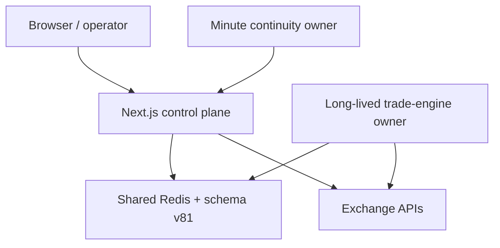

# Architecture and ownership

## System shape

CTS-K-N is one logical system with two supported production topologies.

The web application exposes the UI, API routes, migrations, stats, settings,
admin controls, and exchange actions. Shared Redis is the durable coordination
plane. A long-lived process owns continuous engines. One scheduler owner calls
the continuity routes. Exchange mutations remain serialized and guarded even
when analysis/evaluation work is parallel.

## Supported production topologies

| Concern | Independent Linux server | Kilo / Cloudflare + independent owner |
| --- | --- | --- |
| UI/API | `next start` under systemd/PM2 | OpenNext Worker |
| Permanent trade engine | Same app service | Independent Linux owner |
| Minute continuity | Separate scheduler service | Cloudflare Cron Trigger |
| Live recovery | Scheduler plus long-lived process | Cloudflare Cron plus owner |
| Durable state | Network Redis | The same network/REST Redis used by both |
| Remote SSH installs | Local Node route spawns SSH | Kilo securely proxies to owner |
| Process-local Redis | Forbidden in production | Forbidden in production |

The Kilo Worker is deliberately marked `DISABLE_TRADE_ENGINE_IN_PROCESS=1` and
`DISABLE_IN_PROCESS_CONTINUITY=1`. Request workers cannot prove permanent timer
ownership. `custom-worker.ts` supplies the platform `scheduled()` handler;
`wrangler.jsonc` owns the `* * * * *` trigger. The external owner performs the
permanent engine loop and can execute SSH installations.

## Application layers

| Layer | Primary paths | Responsibility |
| --- | --- | --- |
| Presentation | `app/**/page.tsx`, `components/` | Dashboard, settings, presets, install/operations UI |
| HTTP control | `app/api/**/route.ts` | Settings, engine, stats, admin, exchange, cron, install, health |
| Domain coordination | `lib/strategy-coordinator.ts`, `lib/indication-*`, `lib/preset-*` | Set construction, evaluation, axes, selection, stats |
| Trading pipeline | `lib/trade-engine/`, `lib/trade-engine.ts` | Main/Real/Live execution, locks, outboxes, recovery |
| Exchange integration | `lib/exchanges/`, connector/service modules | Market data, orders, leverage/margin, position/order reads |
| Persistence | `lib/redis-db.ts`, `lib/redis-migrations.ts`, `lib/pos-history.ts` | Redis adapter, schema, exact lineage/results |
| Runtime ownership | `instrumentation.ts`, continuity/auto-start modules, `custom-worker.ts` | Startup, owner detection, timers, scheduled events |
| Deployment | `scripts/install.sh`, Kilo scripts/config, verification scripts | Precheck, build, install, migrate, restart, verify, rollback |

## Ownership and concurrency invariants

- One authoritative live position exists per connection, symbol, and direction.
- Standard/default dispatch happens before Block or DCA adjustment dispatch.
- Block and DCA attach to a confirmed parent; they never open a competing
  standalone venue position.
- An account-wide hardened smoke lock and per-position mutation locks serialize
  risky exchange actions.
- Durable client order IDs and pending accumulation records are written before
  submission, enabling restart recovery without blind resubmission.
- Active exact Sets survive PF/DDT and memory caps until terminal
  reconciliation, preventing orphaned exchange exposure.
- Scheduler routes use a Redis minute-bucket `NX` lease, so Cloudflare and an
  accidental second caller cannot duplicate the same minute's work.
- Settings saves use serialized recoordination, durable version/event markers,
  and cache invalidation; UI confirmation is tied to completion, not a timeout.

## Framework and reproducibility baseline

- Node.js: `>=20` (installers target Node 22 LTS when upgrade is required).
- Package manager: pnpm `10.28.1`, pinned in `package.json`.
- Web: Next.js 15, React 19, TypeScript.
- Kilo runtime: `@opennextjs/cloudflare` and Wrangler, exact versions pinned.
- Persistence: Redis network protocol or supported Redis REST adapter.
- Schema: sequential migrations in `lib/redis-migrations.ts`; do not hardcode
  the number outside verification/manifests without updating it everywhere.

See `manifests/summary.json` for the exact current revisions and counts.
