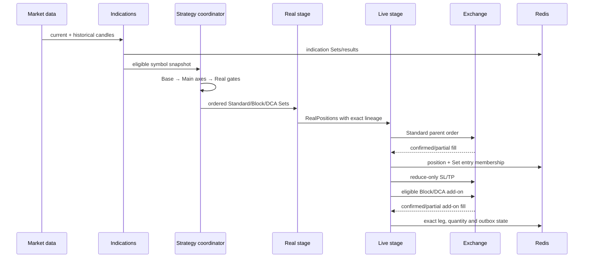
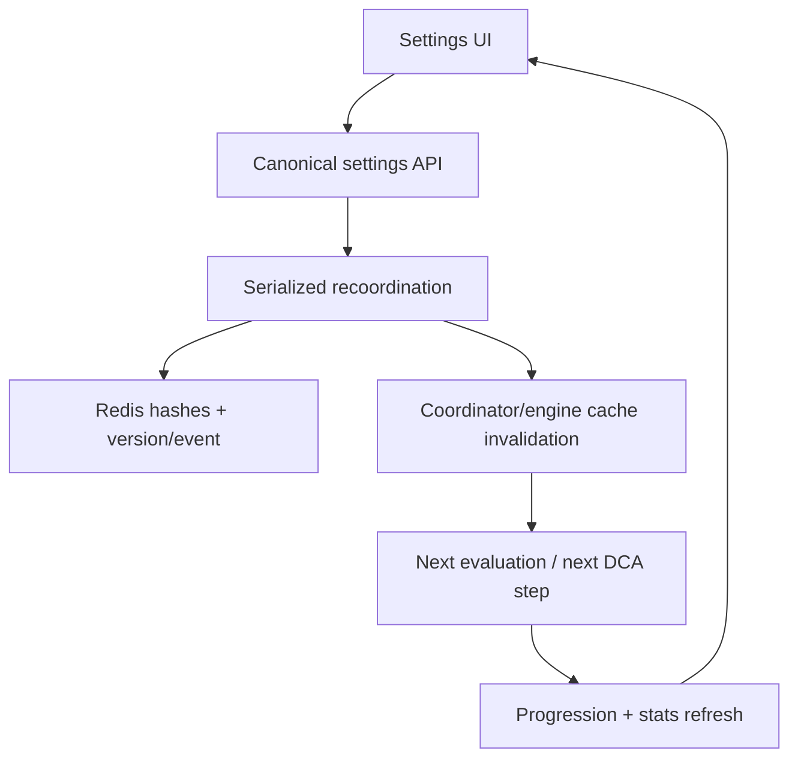

# Runtime and data flow

## Startup

1. Next instrumentation detects the deployment runtime and initializes Redis.
2. Production readiness refuses unsafe process-local persistence unless it was
   explicitly allowed for a local non-live diagnostic.
3. Sequential Redis migrations run or readiness remains false.
4. A durable site-instance identity is loaded/created in Redis.
5. On a long-lived owner, engine auto-start and the in-process recovery runner
   attach. On Kilo/serverless, timers and permanent engines remain disabled.
6. The external minute scheduler or Cloudflare scheduled handler calls the two
   authenticated cron routes.
7. `/api/system/init-status`, health, persistence, database-status and engine
   status expose current owner/readiness evidence.

## Analysis-to-exchange sequence

## Stage semantics

### Indication and Base

Historical/realtime market data produces indication configurations. Base Sets
carry immutable entries, direction, indication type, confidence, PF/DDT, and
optional trailing profiles. A trailing profile is a Base range-coordination
type, not a late Main adjustment.

### Main

Main validates minimum position count, ProfitFactor, drawdown time, confidence,
and settings. It materializes only reached axis windows:

- Previous: PF filter over the last N completed results;
- Last: realized positive/negative outcome over the last M completed results;
- Continuous: direction-specific confirmed active entries;
- Pause: completed-position pause window;
- outcome and long/short direction.

Open positions are excluded from completed-result PF windows. Continuous is the
intentional active-book exception.

### Real

Real applies its own minimum count/PF/DDT gate, exact active-position exemption,
hedge coordination, resource ceilings, tuning, and variant fairness. Active
exact Sets remain even above the nominal ceiling. Non-default reserve protects
enabled DCA/trailing candidates from a much larger default axis fan-out.

Independent Block Count Sets are built and evaluated here for every eligible
source and configured count. They are visible to Real stats and caps before
Live selection.

### Live

Live chooses a bounded ordered dispatch: Standard first, then at most one Block
and one DCA candidate per direction/cycle. A Block/DCA RealPosition without a
confirmed parent is rejected/deferred. Paper simulation follows the same order
and adjustment path so it exercises the exchange contract without venue calls.

When real trading was requested but readiness fails, the position is rejected
with the gate code; it does not silently turn into paper trading.

## Exchange mutation contract

1. Acquire connection/symbol/direction or position mutation lock.
2. Persist durable client-order/outbox metadata before submission.
3. Submit with a deterministic client order ID.
4. Recover ambiguous submission by client ID/order ID; never blind retry.
5. Apply only confirmed fill delta. Partial fill keeps pending state.
6. Cancel/re-arm reduce-only protection for the confirmed aggregate quantity.
7. Record exact Set entry membership only after confirmation.
8. Reconciliation compares local and exchange positions/orders.
9. Closing books realized outcomes idempotently before deleting active
   membership; a crash cannot lose the PF/DDT sample.

## Settings data flow

Strategy-affecting fields are fingerprinted and mirrored to the required legacy
and canonical hashes in one serialized commit. `forceNextSettingsReload`
invalidates PF windows, coordination/hedge settings, position context, symbol
fingerprints and derived Set caches. DCA additionally layers the latest
persisted flat fields over the last position-local recovery profile on every
step decision.

## Continuity

Both cron routes use a durable minute bucket with Redis `NX`/expiry. The server
continuity route heals engine intent and indication progress. The live recovery
route reconciles terminal/ambiguous live positions. Each writes timestamp,
source, duration, result, and error counts used by readiness and post-deploy
verification.
