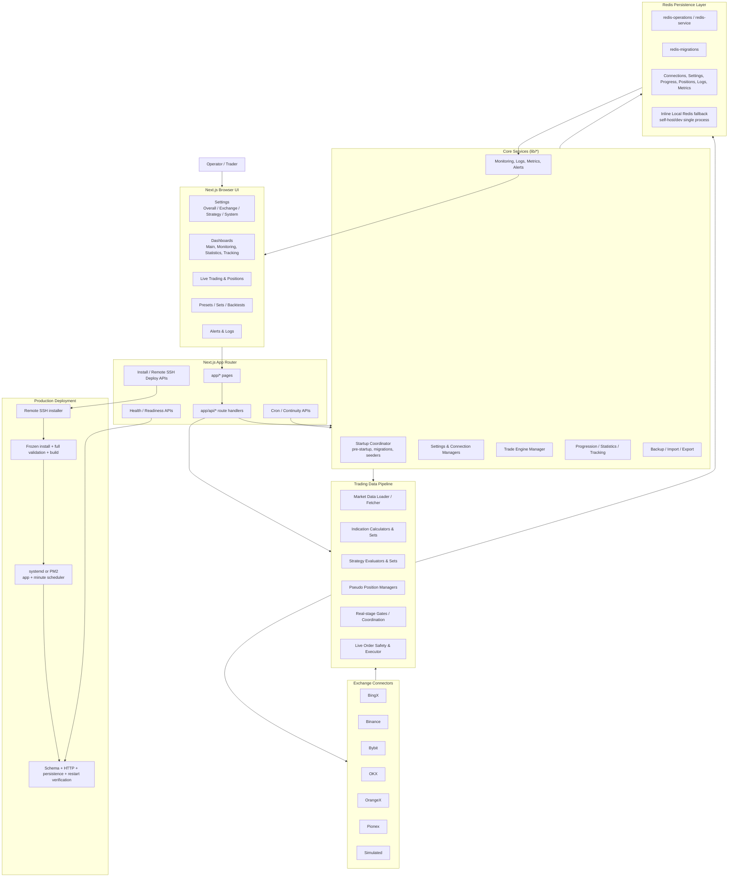
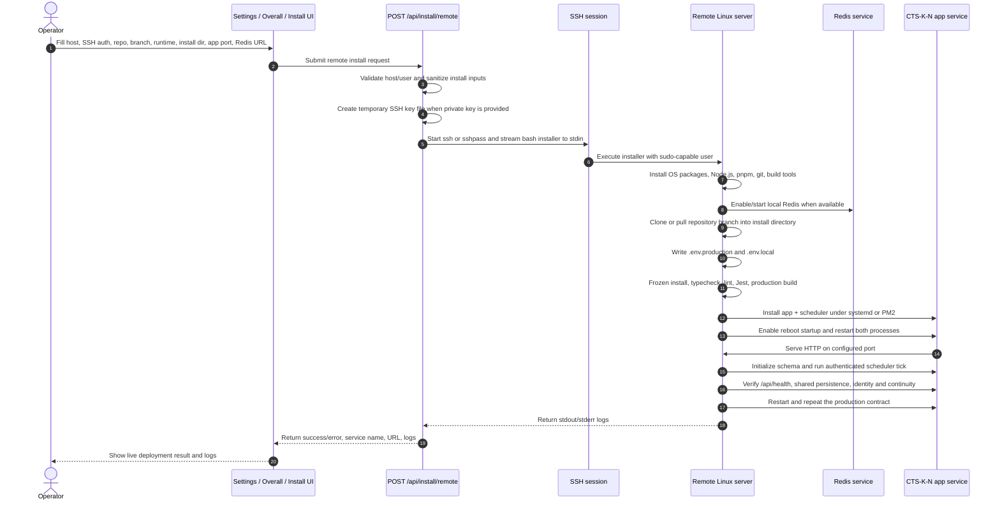
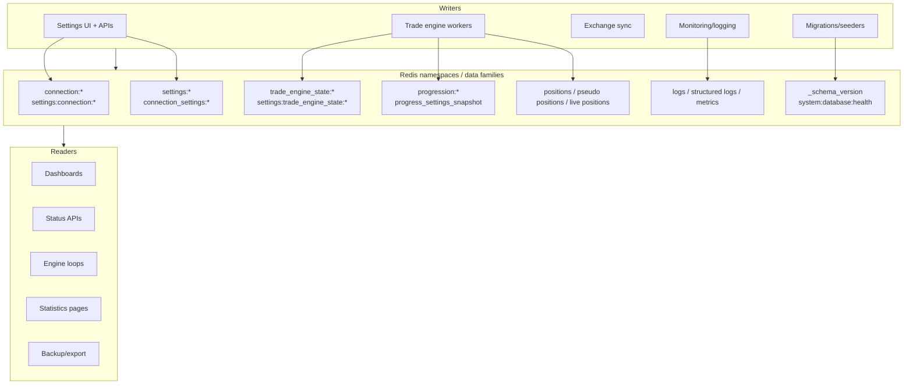
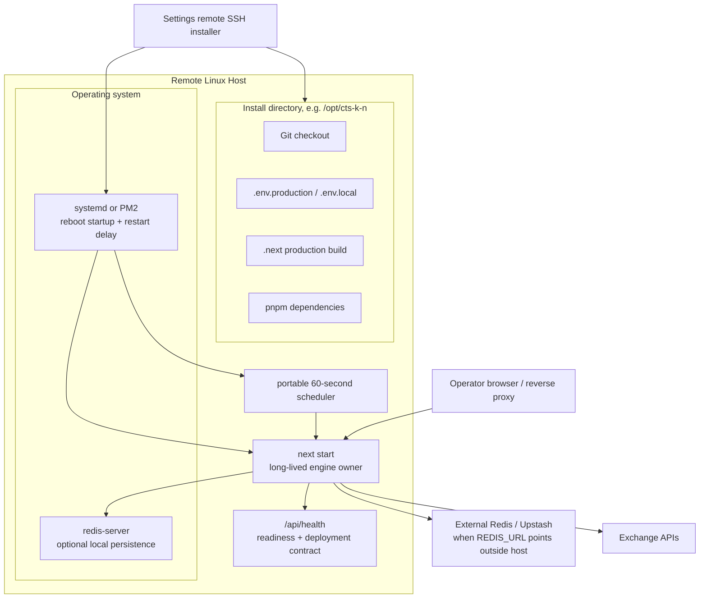

# CTS-K-N System / Modules Picture

This document is a visual map of the CTS-K-N trading platform. It shows how the UI, API routes, trade engines, data-processing modules, exchange connectors, Redis persistence, monitoring, and deployment flows fit together.

## 1. Full System Overview

## 2. Module Responsibilities

| Layer | Main files / directories | Responsibility |
| --- | --- | --- |
| UI pages | `app/*`, `components/*` | User-facing pages, settings forms, dashboards, statistics, live-trading views, monitoring panels, alerts, and install controls. |
| API layer | `app/api/*` | Server actions for settings, install, trade-engine control, progression stats, health checks, monitoring, backups, presets, positions, and exchange operations. |
| Startup / deploy | `lib/startup-coordinator.ts`, `lib/pre-startup.ts`, `lib/redis-migrations.ts`, `app/api/install/*` | Initialize Redis schema, seed required defaults, expose install/status endpoints, and support production/remote deployment. |
| Settings / connections | `lib/connection-manager*.ts`, `lib/connection-settings.ts`, `lib/settings-storage.ts`, `components/settings/*` | Store and edit exchange connections, credentials, symbols, engine options, per-connection settings, and global settings. |
| Trade engine | `lib/trade-engine.ts`, `lib/trade-engine/*`, `lib/symbol-data-processor.ts` | Main runtime loop that loads market data, computes indications/strategies, coordinates stages, manages progress, and controls live execution. |
| Indicators / strategies | `lib/indication-*.ts`, `lib/strategy-*.ts`, `lib/indicators/*` | Calculate indication sets, evaluate strategies, process strategy sets, and produce signals used by pseudo/real/live stages. |
| Positions / orders | `lib/*position*.ts`, `lib/order-executor.ts`, `lib/live-order-safety.ts`, `lib/real-trade-gates.ts` | Track pseudo and live positions, enforce gates/safety, size orders, reconcile live state, and place/close exchange orders. |
| Exchanges | `lib/exchange-connectors/*` | Exchange-specific adapters for market data, account data, orders, positions, and simulated trading. |
| Persistence | `lib/redis-*.ts`, `lib/local-redis.ts`, `lib/db-*.ts` | Redis-backed data store plus compatibility helpers and local single-process fallback. |
| Monitoring | `lib/*logger*.ts`, `lib/*metrics*.ts`, `app/api/monitoring/*`, `components/monitoring/*` | Runtime logs, structured logs, metrics, status, alerts, dashboards, and troubleshooting endpoints. |
| Presets / backtests | `lib/preset-*.ts`, `lib/backtest-engine.ts`, `components/presets/*` | Preset management, preset coordination engines, evaluations, backtests, and performance displays. |

## 3. Trading Pipeline Picture

```mermaid
flowchart LR
  A["Configured Connection\ncredentials + symbols + settings"] --> B["Startup / Quick Start\nload defaults + migrations"]
  B --> C["Market Data\nlatest + prehistoric candles"]
  C --> D["Indicators\nstep-based and set processors"]
  D --> E["Strategies\nbase/main/real/live evaluation"]
  E --> F["Pseudo Positions\nsimulation and statistics"]
  F --> G["Real-stage Coordination\ngates, blocks, progression"]
  G --> H{"Live enabled?"}
  H -- "No" --> I["Stats only\nprogression + dashboards"]
  H -- "Yes" --> J["Live Safety\nlimits, system-close mode, sizing"]
  J --> K["Order Executor"]
  K --> L["Exchange Connector"]
  L --> M["Exchange API"]
  M --> N["Live Positions / Orders"]
  N --> O["Redis state + logs + metrics"]
  O --> I
  O --> C
```

## 4. Settings → Overall → Install / Remote Deploy Picture

## 5. Data Flow / Redis Key Families

## 6. Production Runtime Picture

## 7. Operational Notes

- The browser never calls exchanges directly; it calls Next.js API routes, and server-side modules call exchange connectors.
- Redis is the central coordination layer for settings, progress, positions, logs, health, and metrics.
- Self-hosted production runs one long-lived `next start` engine owner and one portable minute scheduler under systemd or PM2.
- Kilo/Cloudflare request workers own HTTP and the scheduled recovery trigger; a distinct long-lived owner is required for sub-second engine processing and SSH installation.
- Multi-instance or serverless production should use a shared durable Redis URL instead of relying on the inline local fallback.
- Remote SSH deployment requires a sudo-capable SSH user. Private-key auth is preferred; password auth only works when `sshpass` is installed on the web server that runs the installer endpoint.
